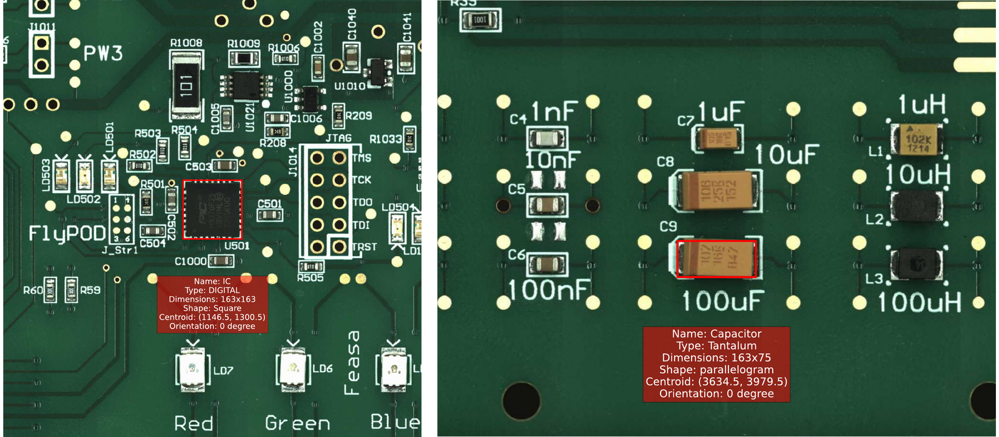
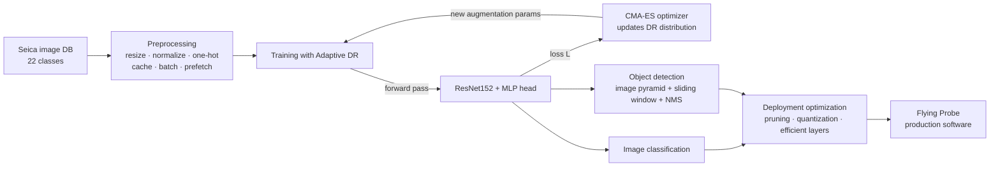
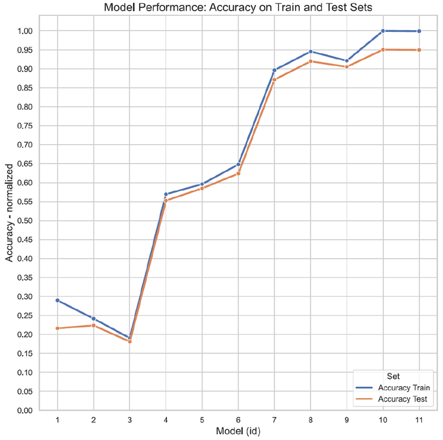
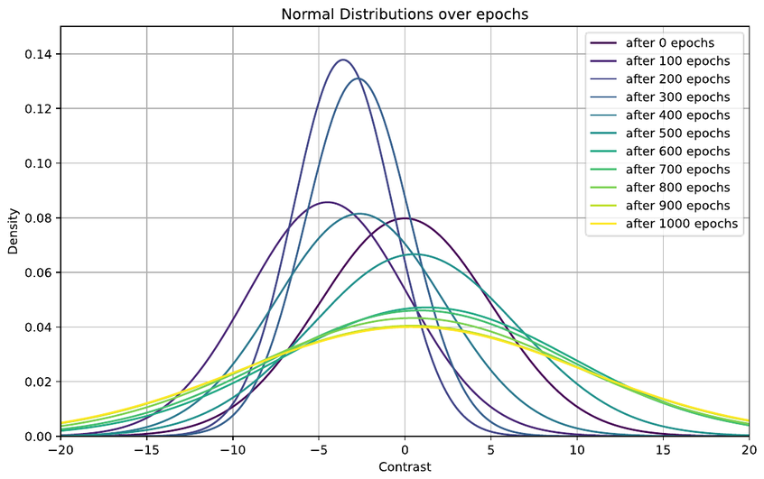

# Electronic Components AI Detection

**Deep learning for automatic recognition of electronic components on Printed Circuit Boards (PCBs), deployed on industrial Automatic Test Equipment.**


[](https://github.com/gcadau/Electronic-Components-AI-Detection/actions/workflows/lint.yml)

MSc thesis in **Data Science and Engineering** — Politecnico di Torino, in collaboration with [**Seica S.p.A.**](https://www.seica.com) (Automatic Test Equipment manufacturer), A.Y. 2023/24.

> **Author:** Giovanni Cadau · **Advisor:** Prof. Daniele Apiletti · **Company advisors:** Paolo Chiartano, Ing. Francesco Grassino

📕 [Full thesis (PDF)](docs/thesis.pdf) · 📝 [Paper-style summary (PDF)](docs/paper.pdf) · 🎞️ [Defense slides (PDF)](docs/presentation.pdf)

<p align="center">
  
</p>
<p align="center"><sub><i>Model output on PCB regions: bounding box, class, dimensions, shape, centroid, and orientation per component.</i></sub></p>

---

## Overview

Electronic testing of PCBs requires locating and identifying specific components (resistors, capacitors, ICs, …) — a task traditionally performed manually by domain experts: slow, error-prone, and hard to scale. This project automates it end-to-end and integrates the resulting models into Seica's production software driving **Flying Probe** test systems.

The work covers the full lifecycle: data collection from Seica's image database, preprocessing/augmentation pipeline, comparison of 11 model architectures, a novel **Adaptive Domain Randomization** scheme for robustness to environmental shift, a sliding-window **object-detection** pipeline, and a systematic **inference-optimization study** (pruning, quantization, efficient layers) benchmarked on the real industrial hardware.

## Highlights

- 🎯 **95.0% test accuracy** on 22 component classes with a ResNet152 backbone (ImageNet transfer learning) + custom MLP head — vs. 18–22% for SVM baselines with handcrafted features.
- 🎲 **Adaptive Domain Randomization (ADR):** augmentation parameters (brightness, contrast, flips, hue, JPEG quality, saturation) are drawn from parametric distributions whose coefficients are **optimized during training by CMA-ES** (gradient-free, via Nevergrad) in a parallel branch of the network. On a deliberately domain-shifted test set: **82.5% → 99.9% accuracy** (+17.4 pp) with no manual re-tuning.
- 🔍 **Object detection on full PCB images:** multi-scale sliding window (image-pyramid), per-window classification, Non-Maximum Suppression with IoU — outputs bounding box, class label, confidence, and centroid for each component.
- ⚡ **Industrial deployment study:** 30 optimized model variants evaluated on the Flying Probe host hardware (1,000 inferences each). Best trade-off (binary quantized network, QAT): **−38% latency, −66% memory, −40% energy** at 95.6% accuracy.
- 🔀 **Dual framework implementation:** every module (data, DR layers, networks) ships in both **TensorFlow** (`tf/`, primary) and **PyTorch** (`pt/`).

## Method at a glance



Four families of randomization distributions are supported — uniform, triangular, univariate normal, and full **multivariate normal** (7-dimensional, learned covariance across augmentation parameters). The multivariate normal + CMA-ES combination is the one that closes the domain gap.

## Results

### Model selection (11 architectures, 5-fold CV, Adam, categorical cross-entropy)

| Family | Models | Feature engineering | Test accuracy |
|---|---|---|---|
| SVM | 1–3 | HOG, PCA | 18.1 – 22.4% |
| Custom CNNs | 4–6 | raw 3D tensor | 55.3 – 62.4% |
| ResNet-based | 7–11 | transfer learning (ImageNet) | 87.1 – **95.0%** |

Best model (**Model 10**): ResNet152 pretrained on ImageNet + dense head 1024–2048–1024 → **95.03% test / 99.98% train** (precision, recall, F1 all ≈ 95%).

<p align="center">
  
</p>

### Robustness under domain shift ((A)DR, evaluated on a new, visually different dataset)

| Training regime | Test accuracy |
|---|---|
| Baseline (no randomization) | 82.46% |
| DR — uniform / triangular / univ. 𝒩 / multiv. 𝒩 | 87.9 – 90.3% |
| ADR (CMA-ES) — uniform / triangular / univ. 𝒩 | 91.4 – 93.2% |
| **ADR (CMA-ES) — multivariate 𝒩** | **99.88%** |

<p align="center">
  
</p>
<p align="center"><sub><i>ADR in action: the contrast component of the multivariate normal augmentation distribution, reshaped by CMA-ES across 1,000 epochs.</i></sub></p>

### Deployment on industrial hardware (1,000 inferences, Flying Probe host)

| Variant | Accuracy | Latency | Memory | Energy |
|---|---|---|---|---|
| Reference (Model 10, in-domain) | 99.98% | 587 s | 763 MB | 21.3 Wh |
| Binary NN, QAT, weights+activations (v27) | 95.62% | **362 s** | **258 MB** | **12.8 Wh** |
| Grouped conv (G=32) + 16-bit minifloat QAT (v8) | 99.87% | 463 s | 501 MB | 16.2 Wh |
| Grouped conv (G=64) + saliency pruning (v21) | **99.91%** | 549 s | 581 MB | 19.2 Wh |

Full grid of 30 variants (data-reuse patterns × efficient layers × pruning × quantization) in the [thesis](docs/thesis.pdf), Ch. 7.

## Repository structure

⚠️ **This repository uses branches as released versions** — there is no single trunk. Each `version-X.Y` branch is a self-contained snapshot with a specific purpose:

| Branch | Purpose |
|---|---|
| `version-0.0` → `version-6.0` | Iterative development (notebooks: `main_tf.ipynb`, `main_pt.ipynb`, `demo.ipynb`); `version-6.0` is the default branch |
| **`version-7.0`** | **Standalone training package** — CLI script `train.py` with full options (splits, transforms, DR distributions, network choice) |
| `version-8.0` | Standalone evaluation package — `test.py` |
| `version-9.0`, `version-12.0` | Later development snapshots (notebooks) |
| `version-10.0`, `version-11.0`, **`version-13.0`** | **Deployable inference library** (`interface` package: `detect_objects`, `classify`); **`version-13.0` is the latest** |

### Layout of `version-13.0` (inference library)

```
├── interface/                  # public API: detect_objects(), classify()
├── algorithm/
│   ├── deep/{tf,pt}/           # ResNet-based network definitions
│   ├── domain_randomization/
│   │   ├── {tf,pt}/            # DR layers: uniform, triangular, univ./multiv. normal
│   │   └── optimization/       # ADR layers (CMA-ES-optimizable coefficients)
│   └── utils/                  # data loading, DR parameter handling
├── Input/
│   ├── dataset/                # sample component crops (Seica)
│   └── regions/                # sample full-PCB image + classes.txt (22 classes)
├── in/model/                   # → pretrained weights (Google Drive link inside)
└── requirements.txt
```

## Quick start

Requires **Python 3.7** (TensorFlow 2.11 pin).

### Inference (`version-13.0`)

```bash
git clone -b version-13.0 https://github.com/gcadau/Electronic-Components-AI-Detection.git aidet
cd aidet
pip install -r requirements.txt
```

Download the pretrained model from the link in [`in/model/model.md`](../../tree/version-13.0/in/model) and place it under `in/model/`. Then, from a client script located next to the `aidet` folder:

```python
from aidet.interface import detect_objects, classify

# Full-PCB object detection: list of (x, y, w, h, centroid_x, centroid_y, label, confidence)
detections = detect_objects(data_path="aidet/Input/regions", gpu=True)

# Single-crop classification
predictions = classify(data_path="aidet/Input/regions")
```

All options (paths, color format, GPU, verbose logging) are documented in the branch's [`USAGE.md`](../../blob/version-13.0/USAGE.md).

### Training (`version-7.0`)

```bash
git clone -b version-7.0 https://github.com/gcadau/Electronic-Components-AI-Detection.git aidet-train
cd aidet-train
pip install -r requirements.txt
python train.py --data_path Input/dataset --split auto --normalize --resize --one_hot_encoding
```

`train.py --help` exposes the full configuration surface: train/validation split, normalization presets per color mode, resizing, choice of ResNet variant (five presets from fast-and-light to deep), DR/ADR distribution family and coefficients, and gradient-free optimizer selection.

## Dataset

Training images come from Seica's proprietary production database (high-resolution photos of PCBs used in Seica test systems, annotated per component). **The full dataset is not redistributable**; a handful of sample crops is included under `Input/dataset/` and one full board image under `Input/regions/` to run the demos. The 22 target classes are listed in [`Input/regions/classes.txt`](../../blob/version-13.0/Input/regions/classes.txt) (ceramic/tantalum capacitors, resistors, inductors, diodes, LEDs, ICs, connectors, relays, …).

## Tech stack

TensorFlow 2.11 / Keras · PyTorch · TensorFlow Probability · [Nevergrad](https://github.com/facebookresearch/nevergrad) (CMA-ES and other gradient-free optimizers) · scikit-learn · NumPy · Pandas · Matplotlib · TensorBoard

## Citation

If you use this work, please cite:

```bibtex
@mastersthesis{cadau2024ecad,
  author  = {Cadau, Giovanni},
  title   = {Artificial Intelligence Algorithms for Electronic Component Recognition},
  school  = {Politecnico di Torino},
  year    = {2024},
  type    = {Master's thesis in Data Science and Engineering},
  note    = {In collaboration with Seica S.p.A.}
}
```

## Acknowledgments

Developed at **Seica S.p.A.** (Strambino, Italy) within the MSc program in Data Science and Engineering at **Politecnico di Torino**. Thanks to Prof. Daniele Apiletti (academic advisor) and to Paolo Chiartano and Ing. Francesco Grassino (company advisors).

## License

Source code © Giovanni Cadau. The dataset and pretrained models derive from Seica S.p.A. proprietary data and are provided for demonstration purposes only. For any other use, please open an issue.
